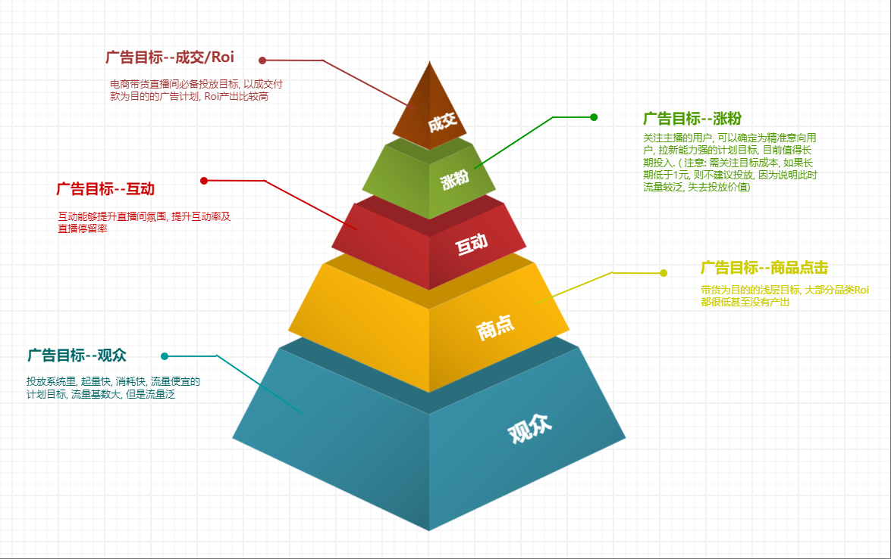
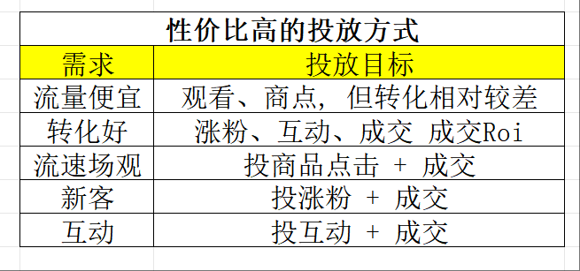
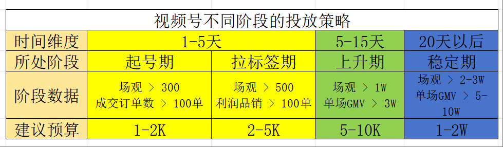

# 视频号广告投流-2024年12月
# 广告投放须知
1. 投产比和品类有很大关系
2. 投产比和产品竞争力有很大关系
3. 投产比和主播能力有很大关系
4. 投产比和账号权重有关系
5. 投产比和营销策略有关系
6. 投产比和投手技术有关系
注意: 投放, 只是把有 **目标行为(优先提升目标)** 的人, 带来到直播间; 而转化, 是**多个岗位共同协作**得到的结果

# 投放算法思维
## ECPM值排名 = 预估点击率(eCTR) X 预估转化率(eVCR) * 出价* 1000
eCPM --> 千次展示费用(目前主流平台计费模式, 按展示计费)

# 如何选择合适的投放工具 ---微信豆和Adq的功能对比

## 微信豆和Adq都适合什么样的模式
- 微信豆: 直播带货
- Ada : 直购带货
## 投放人群
- 微信豆: 可定义人群年龄、性别、地域、兴趣
- Adq 
	- 可自定义人群
	- 可创建人群包

## 投放渠道
- 微信豆: 只能投放视频号站内
- Adq
	- 视频号
	- 朋友圈
	- 公众号
	- 小程序
	- 新闻插件
	- 搜索场景
	- QQ浏览器
	- QQ
	- 腾讯音乐/游戏/新闻/腾讯视频号/优量汇

## 流量拓展逻辑
- 微信豆: 根据自定义人群包, 直播间数据反馈进行拓展
- Adq: 依托于**素材(短视频/直播)内容**, 系统进行拓展

## 投放人员需具备能力
- 微信豆
	- 直播运营能力
	- 直播排品、节奏
	- 流量转化分析能力
- Adq
	- 短视频素材能力
	- 数据分析判断能力
	- 直播运营能力
	- 平台人群把控能力

## 流量精准度
- 微信豆: 每个计划都根据基础模型扩展, 数据波动较大
- Adq: 根据短视频素材系统筛选, 标签建立后, 流量准度逐步提升

## 流量逻辑
- 微信豆: 老粉召回, 投产高, 3-5是常态, 10-20ROI也可以达到
- Adq: **流量拉新**, 投产低, 平均ROI 2 以内

## 数据维度
- 微信豆 ----数据维度较少
	- 曝光数据
	- 点击数据
	- 转化数据
- Adq ---- 数据维度全面, 更智能
	- 效果分析
	- 人群分析
	- 广告诊断
	- 优化建议
	- 数据回传

## 门槛
- 微信豆: 100起充, 消耗不完, 退回微信豆账户, 不可兑换人民币
- Adq: 充值1-2万起充, 消耗不完可以退
	- 注意: adq账户会出现超跑现象, 所以账户内余额必须大于预算的20%+, 一旦超跑会封户

# 微信豆
## 微信豆付费投放工具介绍
### 微信豆充值
- 人民币比例: 1 : 10
- 苹果账户和安卓账户**不互通** (同一账户, 在安卓/苹果设备登录充值的微信豆, 在另一个平台是不可用的)
- 苹果充值比例: 1 : 7
- 微信豆充值以后不可退
### 其他支付方式
- 通用券
- 商家激励券 --- 平台活动/任务获得
- 成本保障券 --- 流量成本超预算获得
### 投产数据
- 常规行业在5-10 (例如服饰, 食品, 日用品等)
- 高客单, 达人IP直播间 50±
- 超高客单会出现极高的投产(如翡翠,珠宝行业)

## 微信豆各转化目标特征
### 微信豆基础理论和玩法 ( 标准订单)
#### 加热素材
- 直播间
	- 达人推荐/粉丝兴趣二选一
	- 基础+ 相似达人/ 基础+ 相似兴趣  二选一
- 短视频
	- 通投 -- 做一些基础定向就行(年龄, 性别)
#### 加热方式
- 控成本 --有保价, 投产相对稳定, 用于数据稳定, 可有赔付
- 放量 -- 放量加热: 无保价, 投产忽高忽低, 用于测试模型, 快速拿量
- 注意
	- 两个方式是不同的池塘, 建议分开户跑 
	- 放量加热只能搭配深层目标
	- 准备多个投放账户: 对抗不确认性
#### 优先提升目标
- 商点
- 成交
- ROI
- 观众
- 互动
平台的本质: 卖流量  
流量分层: 流量价值最大化  
如何跳出算法囚笼: 人设 --- 所谓人设, 就是从专业上给自己一个身份
#### 加热时长
- 一般比直播时长长一个小时, 让均匀度更高
	- 目前我个人建议是单场直播时长至少5-6小时(视频号拉时长目前是有效的), 所以计划投放时长也是6-12小时为主, 给系统更多的时间去探索流量
#### 观众年龄
- 不建议<30的人群
#### 达人推荐
- 曝光逻辑: 两个直播间同时展现给用户, 让用户二选一
- 不限于同行, 粉丝人群类似也行(更建议)
#### 城市
- 开始建议通投, 除非有季节属性或者地域性产品(这样是为了快速打上成交标签)
- 后期可以将偏远地区或不赚钱的地区去掉
#### 兴趣
- 前期 - 大类目3-5个(产品受众人群相关)
#### 出价
- 最高不能超过毛利的8折
	- 如果跑不动增加一条放量的投放
	- 或者增加浅层(建议互动/涨粉)的放量投放
### 六大投放目标含义及标准(投放目标指的是: 客户在平台有相应动作)

#### 观众
- 投放系统里, 起量快, 消耗快, 流量便宜的计划目标, 流量基数大, 方式流量泛
- 带货不建议, 一般是用于娱乐直播
- 注意
	- 6微信豆/ 智能出价(2豆起投)  
	- 观众是浅层流量, 新号启动破场观使用
#### 商点
- 大部分品类ROI都很低或者没有产出
	- 中下精准
	- 流量不贵
	- 流量也泛
	- 有赔付
#### 互动
- 互动能够提升直播间氛围, 提升互动率及直播停留率
#### 涨粉
- 关注主播的用户, 可以确定为精准意向用户, 拉新能力强的计划目标, 目前值得长期投入
#### 成交
- 电商带货直播间必备投放目标, 以成交付款为目的的广告计划, Roi产出比较高
- 曝光给已有成交行为的人群
#### ROI
- 按照本场成交模型, 去做流量探索
### 五大投放目标特点及注意事项
#### 观众
- 特点
	- 量特别泛
	- 强人货场
	- 没有赔付
- 注意事项
	- **建议6微信豆**/智能出价(2豆起投)
	- 观众是**浅层流量**, 新号启动破场观使用
	- 圈**年龄, 性别, 兴趣等标签**拿精准人群
	- 几乎**不产出Roi**
#### 商点
- 特点
	- 中下精准
	- 流量不贵
	- 流量也泛
	- 有赔付
- 注意事项
	- 出价: **30-300豆**
	- **下单意向度高**
	- 适用于**单品或者Sku较少**的直播间
	- 圈选 年龄, 性别, 兴趣标签
	- 组合投放: 商点**带动成交及其他计划消耗**
	- 目前 **80%以上直播间不产Roi**
#### 互动
- 特点
	- 中等精准
	- 可拉互动
	- 有ROI
	- 有赔付
- 注意事项
	- 出价 **40-220豆之间**, 自定义出价
	- **优化更精准的人群**
	- **拉动直播间停留**
	- 圈 年龄, 性别, 兴趣, 对标直播间
	- **直播间互动差**, 可加强互动目标投放
#### 涨粉
- 特点
	- 较为精准
	- 快速拉新
	- 矫正人群
	- 有赔付
- 注意事项
	- 建议出价 **100-900豆**
	- **适用于前期起号及稳定期拓量**
	- 圈选年龄, 性别, 兴趣标签, **优化直播间人群标签**
	- 投放时长4-6小时起, 跑得慢, 投2-3小时, 跑得快, 投6-12小时
#### 成交/ROI
- 特点
	- 最深精准
	- 高客单价
	- 重点投放
	- 有赔付
	- 新号: 很难跑出去
	- 老号: 薅深层次人群
- 注意事项
	- **1.2倍Roi出价**
	- **以结果为导向的计划**
	- 多品直播间必投
	- 圈选年龄, 性别, 兴趣标签, 人群标签精准
	- 适合**直播间稳定期投放, 起号期不建议投放**
### 微信豆赔付标准
[微信豆赔付标准](https://findeross.weixin.qq.com/cgi-bin/mmfindernodelivecrmwebbroker-bin/helper-center/pages/e0nPiztYoBx55kYN)

## 性价比高的投放方式

## 不同品类关注维度
- 高客单 --关注15天, 30天成交
- 中低客单 --关注7天,15天成交
- 低客单 --关注当天, 七天成交
不看单场Roi, 看长期Roi  
多关注: 7天 15天 30天数据
## 视频号不同阶段的投放策略

