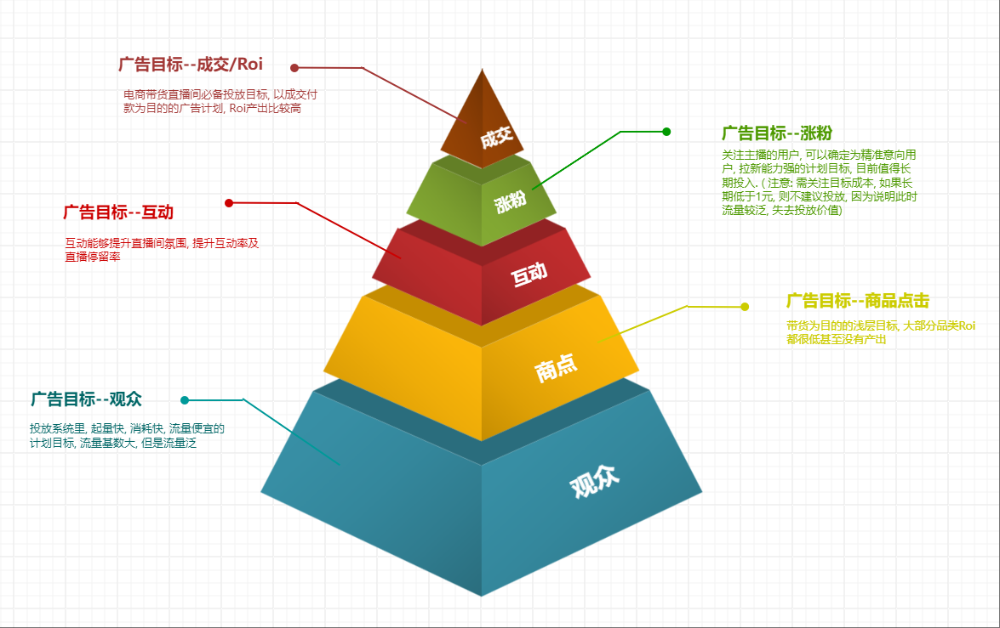
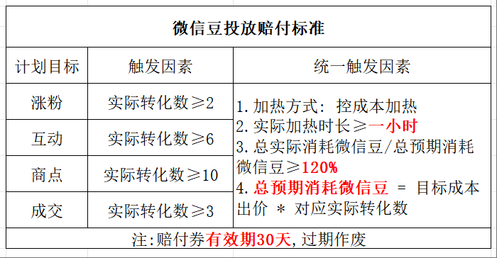
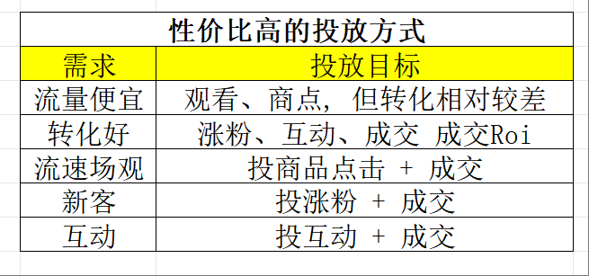
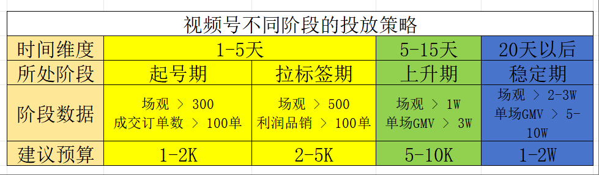
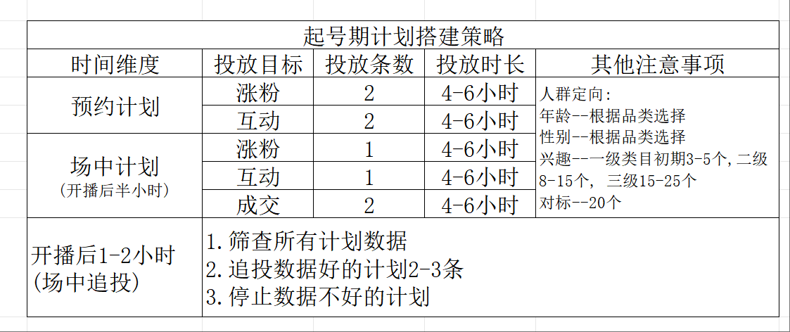
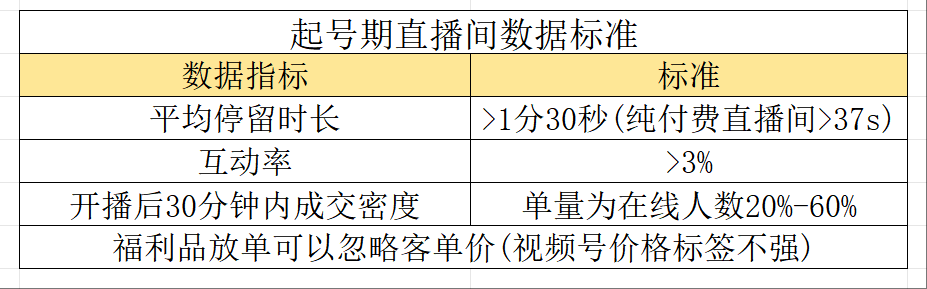
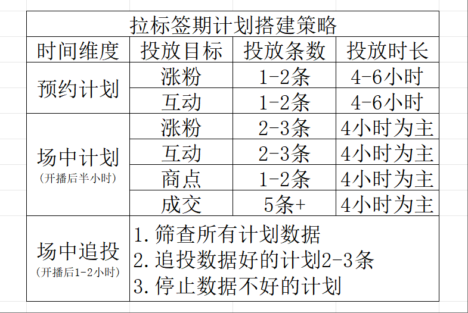
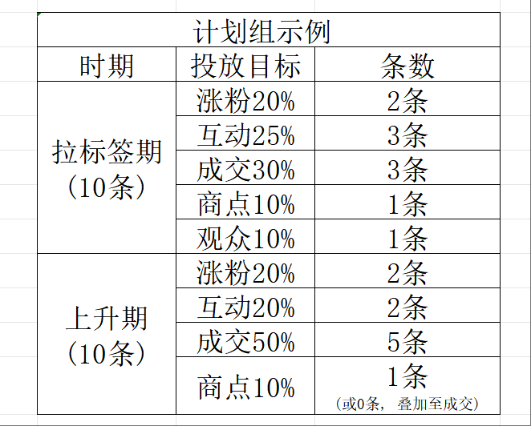
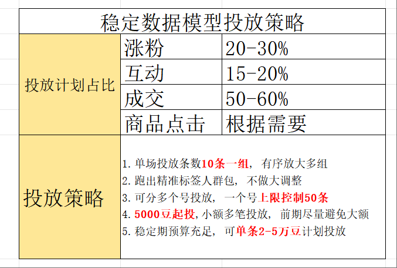

# 视频号广告投流-24年12月
# 广告投放须知
1. 投产比和品类有很大关系
2. 投产比和产品竞争力有很大关系
3. 投产比和主播能力有很大关系
4. 投产比和账号权重有关系
5. 投产比和营销策略有关系
6. 投产比和投手技术有关系
注意: 投放, 只是把有 **目标行为(优先提升目标)** 的人, 带来到直播间; 而转化, 是**多个岗位共同协作**得到的结果

# 投放算法思维
## ECPM值排名 = 预估点击率(eCTR) X 预估转化率(eVCR) * 出价* 1000
eCPM --> 千次展示费用(目前主流平台计费模式, 按展示计费)

# 如何选择合适的投放工具 ---微信豆和Adq的功能对比

## 微信豆和Adq都适合什么样的模式
- 微信豆: 直播带货
- Ada : 直购带货
## 投放人群
- 微信豆: 可定义人群年龄、性别、地域、兴趣
- Adq 
	- 可自定义人群
	- 可创建人群包

## 投放渠道
- 微信豆: 只能投放视频号站内
- Adq
	- 视频号
	- 朋友圈
	- 公众号
	- 小程序
	- 新闻插件
	- 搜索场景
	- QQ浏览器
	- QQ
	- 腾讯音乐/游戏/新闻/腾讯视频号/优量汇

## 流量拓展逻辑
- 微信豆: 根据自定义人群包, 直播间数据反馈进行拓展
- Adq: 依托于**素材(短视频/直播)内容**, 系统进行拓展

## 投放人员需具备能力
- 微信豆
	- 直播运营能力
	- 直播排品、节奏
	- 流量转化分析能力
- Adq
	- 短视频素材能力
	- 数据分析判断能力
	- 直播运营能力
	- 平台人群把控能力

## 流量精准度
- 微信豆: 每个计划都根据基础模型扩展, 数据波动较大
- Adq: 根据短视频素材系统筛选, 标签建立后, 流量准度逐步提升

## 流量逻辑
- 微信豆: 老粉召回, 投产高, 3-5是常态, 10-20ROI也可以达到
- Adq: **流量拉新**, 投产低, 平均ROI 2 以内

## 数据维度
- 微信豆 ----数据维度较少
	- 曝光数据
	- 点击数据
	- 转化数据
- Adq ---- 数据维度全面, 更智能
	- 效果分析
	- 人群分析
	- 广告诊断
	- 优化建议
	- 数据回传

## 门槛
- 微信豆: 100起充, 消耗不完, 退回微信豆账户, 不可兑换人民币
- Adq: 充值1-2万起充, 消耗不完可以退
	- 注意: adq账户会出现超跑现象, 所以账户内余额必须大于预算的20%+, 一旦超跑会封户

# 微信豆
## 微信豆付费投放工具介绍
### 微信豆充值
- 人民币比例: 1 : 10
- 苹果账户和安卓账户**不互通** (同一账户, 在安卓/苹果设备登录充值的微信豆, 在另一个平台是不可用的)
- 苹果充值比例: 1 : 7
- 微信豆充值以后不可退
### 其他支付方式
- 通用券
- 商家激励券 --- 平台活动/任务获得
- 成本保障券 --- 流量成本超预算获得
### 投产数据
- 常规行业在5-10 (例如服饰, 食品, 日用品等)
- 高客单, 达人IP直播间 50±
- 超高客单会出现极高的投产(如翡翠,珠宝行业)

## 微信豆各转化目标特征
### 微信豆基础理论和玩法 ( 标准订单)
#### 加热素材
- 直播间
	- 达人推荐/粉丝兴趣二选一
	- 基础+ 相似达人/ 基础+ 相似兴趣  二选一
- 短视频
	- 通投 -- 做一些基础定向就行(年龄, 性别)
#### 加热方式
- 控成本 --有保价, 投产相对稳定, 用于数据稳定, 可有赔付
- 放量 -- 放量加热: 无保价, 投产忽高忽低, 用于测试模型, 快速拿量
- 注意
	- 两个方式是不同的池塘, 建议分开户跑 
	- 放量加热只能搭配深层目标
	- 准备多个投放账户: 对抗不确认性
#### 优先提升目标
- 商点
- 成交
- ROI
- 观众
- 互动
平台的本质: 卖流量  
流量分层: 流量价值最大化  
如何跳出算法囚笼: 人设 --- 所谓人设, 就是从专业上给自己一个身份
#### 加热时长
- 一般比直播时长长一个小时, 让均匀度更高
	- 目前我个人建议是单场直播时长至少5-6小时(视频号拉时长目前是有效的), 所以计划投放时长也是6-12小时为主, 给系统更多的时间去探索流量
#### 观众年龄
- 不建议<30的人群
#### 达人推荐
- 曝光逻辑: 两个直播间同时展现给用户, 让用户二选一
- 不限于同行, 粉丝人群类似也行(更建议)
#### 城市
- 开始建议通投, 除非有季节属性或者地域性产品(这样是为了快速打上成交标签)
- 后期可以将偏远地区或不赚钱的地区去掉
#### 兴趣
- 前期 - 大类目3-5个(产品受众人群相关)
#### 出价
- 最高不能超过毛利的8折
	- 如果跑不动增加一条放量的投放
	- 或者增加浅层(建议互动/涨粉)的放量投放
### 六大投放目标含义及标准(投放目标指的是: 客户在平台有相应动作)

#### 观众
- 投放系统里, 起量快, 消耗快, 流量便宜的计划目标, 流量基数大, 方式流量泛
- 带货不建议, 一般是用于娱乐直播
- 注意
	- 6微信豆/ 智能出价(2豆起投)  
	- 观众是浅层流量, 新号启动破场观使用
#### 商点
- 大部分品类ROI都很低或者没有产出
	- 中下精准
	- 流量不贵
	- 流量也泛
	- 有赔付
#### 互动
- 互动能够提升直播间氛围, 提升互动率及直播停留率
#### 涨粉
- 关注主播的用户, 可以确定为精准意向用户, 拉新能力强的计划目标, 目前值得长期投入
#### 成交
- 电商带货直播间必备投放目标, 以成交付款为目的的广告计划, Roi产出比较高
- 曝光给已有成交行为的人群
#### ROI
- 按照本场成交模型, 去做流量探索
### 五大投放目标特点及注意事项
#### 观众
- 特点
	- 量特别泛
	- 强人货场
	- 没有赔付
- 注意事项
	- **建议6微信豆**/智能出价(2豆起投)
	- 观众是**浅层流量**, 新号启动破场观使用
	- 圈**年龄, 性别, 兴趣等标签**拿精准人群
	- 几乎**不产出Roi**
#### 商点
- 特点
	- 中下精准
	- 流量不贵
	- 流量也泛
	- 有赔付
- 注意事项
	- 出价: **30-300豆**
	- **下单意向度高**
	- 适用于**单品或者Sku较少**的直播间
	- 圈选 年龄, 性别, 兴趣标签
	- 组合投放: 商点**带动成交及其他计划消耗**
	- 目前 **80%以上直播间不产Roi**
#### 互动
- 特点
	- 中等精准
	- 可拉互动
	- 有ROI
	- 有赔付
- 注意事项
	- 出价 **40-220豆之间**, 自定义出价
	- **优化更精准的人群**
	- **拉动直播间停留**
	- 圈 年龄, 性别, 兴趣, 对标直播间
	- **直播间互动差**, 可加强互动目标投放
#### 涨粉
- 特点
	- 较为精准
	- 快速拉新
	- 矫正人群
	- 有赔付
- 注意事项
	- 建议出价 **100-900豆**
	- **适用于前期起号及稳定期拓量**
	- 圈选年龄, 性别, 兴趣标签, **优化直播间人群标签**
	- 投放时长4-6小时起, 跑得慢, 投2-3小时, 跑得快, 投6-12小时
#### 成交/ROI
- 特点
	- 最深精准
	- 高客单价
	- 重点投放
	- 有赔付
	- 新号: 很难跑出去
	- 老号: 薅深层次人群
- 注意事项
	- **1.2倍Roi出价**
	- **以结果为导向的计划**
	- 多品直播间必投
	- 圈选年龄, 性别, 兴趣标签, 人群标签精准
	- 适合**直播间稳定期投放, 起号期不建议投放**
### 微信豆赔付标准
[微信豆赔付标准](https://findeross.weixin.qq.com/cgi-bin/mmfindernodelivecrmwebbroker-bin/helper-center/pages/e0nPiztYoBx55kYN)

## 性价比高的投放方式

## 不同品类关注维度
- 高客单 --关注15天, 30天成交
- 中低客单 --关注7天,15天成交
- 低客单 --关注当天, 七天成交
不看单场Roi, 看长期Roi  
多关注: 7天 15天 30天数据
## 视频号不同阶段的投放策略

### 起号期

- 订单名称: 按照自己的习惯命名 --通俗易懂, 方便后期数据分析
- 选择加热方式: 控成本
- 选择投放目标
- 选择投放预算
- 选择直播间&短视频加热
- 选择加热时长: 一般3-6小时( 略长于直播时间) -- (目前, 按照我个人测试的结果, 建议≥6小时, 给系统更多的时间去探索)
- 添加对标账户 --有对标账户的投放, 会同时给对标账户带来曝光, 所以需要选择人货场都处于劣势的直播间, 
- 选择年龄属性: 一般是30+
- 城市: 建议通投
- 选择兴趣
#### 起号期直播间数据标准

#### 起号期投放注意事项 -- 起号期: **跑的出去比有投产更重要**
- 出价全部**自定义**出价**最低出价**, **跑不动**适当上调 --  避免跑飞
- **预约**计划6小时, **追投**计划4小时
- 复投5条同样计划, 2条跑得动, 3条跑不动正常
### 拉标签期

- 投放目标:涨粉/ 互动/ 点击/ 成交
	- 兴趣优化
		- 年龄--根据受众选择
		- 性别--根据受众选择或通投
		- 兴趣--贴合自己品类勾选
			- 初期: 一级类目:3-5个  二级类目:8-15个   三级类目: 15-25个
		- 地域--特殊商品选择地域, 否则通投
		- 对标直播间: **同类目直播间10+个, 相关联类目直播间10个** -- 注: 不要选头部, 挑选腰部或者和自己人货场相持平的直播间
- 投放目标: 涨粉
	- 涨粉是**长期计划**, roi不会太高, 注重**拉新沉淀**
	- 直播初期, 计划应占总数量的20-30%
	- 不是为了跑ROI, 是为了长期**源源不断的精准意向人群**
	- 非必要, **不要停止**投放涨粉计划
	- **预约投放1-2条, 场中投放1-3条**
- 投放目标: 互动
	- 互动能拉进来相对**精准意向人群**, roi会比较不错
	- 直播初期, 计划应**占总数量的15-20%**
	- 互动目标可多投, 定向能为直播间带来**更好的停留**
	- **预约投放1-2条, 场中追加1-3条**
- 投放目标: 商点
	- 适合**单品直播间**投放, 多品直播间适当补
	- 商点Roi转化效率较低, **必要时期投(其他计划目标不消耗的时候**)
	- 商点计划占投放比例**5-10%**左右, 不宜过多
- 投放目标: 成交
	- 成交流量最为精准, 放到稳定期增加
	- 成交需要基础标签支撑, 否则容易不消耗
	- 前期成交比例控制在**20-40%**, 过高容易导致没流量
#### 计划组示例 

#### 投放会遇到什么问题
-  计划不消耗  -- 计划不消耗归因 -- 建了多条计划, 没有消耗和基础数据- 原因分为起号期和上升期:   
	1. 起号期间五天内, 基础数据没有做好  
	2. 打用户标签破场观
- 计划空消耗
	- 计划空消耗归因 -- 有消耗, 有进人, 就是不成交  --投放计划兴趣标签投偏, 调整人群定向
		- 通过兴趣及对标直播间调整定向
		- 排查计划是否是兴趣通投状态
		- 每条计划单独建人群兴趣包测试
	- 直播间流速不稳归因 -- 投放计划太少, 只有单条计划支撑数据 --增加投放计划, 稳定流速 --常规情况下, **5-10条广告在正常消耗**
	- 无成交归因
		- 投放时长太短导致系统找不到人群 --拉长投放时长, 给系统充足时间优化探索
			- 正常投放时长4-6小时
			- 数据反馈差投12小时
			- **直播时长大于6小时**
		- 直播节奏感太差, 不能成交客户 -- 优化直播节奏, 福利--过渡--利润几个环节调整
			- 初期直播没有标签 , 用福利品拉成交
			- 多品直播间做过品节奏
			- 忘掉抖音和快手的虚伪, 回归真诚
		- 选品失败, 不符合平台用户人群 -- 视频号40+以上中老年用户为主
			- 人群有钱, 有闲, 重品质
			- 无太多电商购物及对比经验, 价格不敏感
			- 高客单, 高利润, 高消耗, 高复购, 私域沉淀

### 上升期 --  放大数据模型
- 放大数据模型
	- 投放计划**数量(条数)**基数放大
	- **转化好**的计划, **直接复投**
	- 投放节奏10-20-30-50-80-100条稳步提升
	- 如果**互相抢量**, 定向做一下**细微调整**, 不要大动
- 优化承接能力
### 稳定期

- 投放注意事项
	- 数据稳定, 说明已经找到用户标签模型, 可放大
	- 加大投入广告预算和投放条数, 推动数据提升
	- 投放条数逐步提升, 数据好可以每天翻倍投放计划
	- 计算一周稳定Roi, 周平均Roi是4, 要到单场40万GMV, 广告投入需要投到8-12万
- 关注指标
	- 破场观前  (5k-10k)
		- 数据维度
			- 停留
			- 互动
			- 关注
			- 粉丝团
			- 分享
		- 动作
			- 憋单放福利
			- 以利诱之
			- 福袋强化
	- 破场观后(1W以上)
		- 数据维度
			- 新客成交密度
			- 停留
			- 互动
			- 预约
			- 涨粉
			- 分享
		- 动作
			- 微憋单
			- 福利
			- 人设强化
			- 福袋强化
			- 钩子品
#### 投放会遇到什么问题
##### 流速不稳归因
- 用户停留, 互动太差导致系统找不到精准人群
	- 注重: 停留, 互动, 成交密度三大数据
	- 福袋, 钩子品, 福利品拉互动
	- 场景, 氛围, 讲故事拉停留
- 直播间氛围, 节奏差, 精准流量不转化
	- 配合鱼塘或小号带公屏节奏, 营销直播氛围
	- 羊群效应是成交重要因素
	- 氛围是成交核心因素
	- 拿掉转化差的产品, 保持直播间成交密度
##### 投放数据波动归因
- 不投浅层, 长期只投深层目标
	- 只投深层拔苗助长, 不投浅层, 直播间就没有浅层人群标签
	- 成交前期投的爽, 后期数据火葬场
	- 广告系统逻辑及由浅入深, 一切不做基础数据的直播间都不长久
	- 涨粉、互动、商点、观众统称浅层
- 排查最近是否大范围调整投放人群包
	- 排查最近是否大范围调整投放人群包, 调整回原来人群包(自身问题)
	- 测试新人群包, 老计划不要做大调整
	- 拿出计划10%来做新人群包测试
	- 进一步收缩人群定向,先打标签
		- 精准选择品类标签
		- 三级标签降至15-20个
- 直播人货场调整, 基础数据直线下降
	- 优化人货场, 通过直播运营手段拉动基础数据
		- 数据阈值, 互动率3-5%, 停留37-90s
		- 人货场大调整, 会导致数据异常三天内恢复
- 排查是否直播节奏做大调整
	- 直播间产品调整, 或节奏调整都会波
		1. 排品不可大调整, 数据波动大
		2. 流量流速过大, 直播节奏也要配合调整
	- 优化人货场提升用户信任和停留
		- 福袋留人, 福利留人, 钩子品留人
- 排查是否平台最近有大的更新调整
	- 1.找视频号助手及视频号小店规则通知
	- 2.找视频号玩家社群沟通, 寻找共性
- 品类淡季导致
	- 由于时令节点导致, 非主观原因导致
- 违规或带货评分低, 售后未处理
	- 评分低, 售后未处理会导致不消耗: 
		1. 带货评分不能低于4.3, 否则限制消耗
		2. 排查是否违规限流
		3. 后台售后及时处理, 否则限制消耗
##### 归因总结 -- 一场数据波动无碍, 连续三场以上找共性 (一场波动为偶然行为1. 视频号系统不断变动, 并非团队原因  2. 连续三场以上, 找出数据波动指标优化)
- 不投浅层, 长期只投深层目标
- 排查最近是否大范围调整投放人群包
- 直播人货场调整, 基础数据阶直线下降
- 排查是否平台最近有大的更新调整
- 品类淡季导致
- 违规带货评分低, 售后未处理
- 一场波动无碍, 连续三场以上找共性
## 全域广告 --目前大多数跑的较差, 不是很建议, 了解即可, 不排除后期会变成主流投放方式的可能
- 全域投放素材如何选择
	- 老素材带着新素材
	- 30%新素材 + 70%老素材
- 全域投放如何优化roi
- 全域投放什么阶段开始比较好
	- 标准版起号, 打模型
	- 全域投放放量
### 影响投放流速的因素 -- 控制变量法
- 出价
- 时长
- 预算
## 影响投放结果的几大因素
- 流量时段
- 小黄车短语
- 素材本身
- sku设计引导
- 投放时段
- 评论区控评
- 商品主图
- 当日竞价成本和千展
- 5s完播率和整体完播率
# Adq
## 版位
## 付费玩法三步走
- 选品-- 建议最多2-3个
	- 视频号
	- 朋友圈
	- 公众号
	- 小程序
- 开户
- 定策略- 定投放策略
	- 投放路径策略
	- 投放素材策略
	- 投放定价策略
	- 投放出价策略