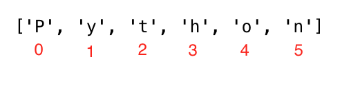

# Day4 : 字符串
文本就是字符串数据类型，任何数据类型写成文本形式都是字符串。被单引号(`''`),双引号(`""`) 或三个引号括起来的也都是字符串。在Python中有很多不同的方法和内置函数来处理字符串数据类型。其中检查字符串长度方法使用 `len()`

### 创建字符串
```python
# 一个字符串可以是单个字符也是多个
letter = 'P' 
print(letter)               # P
print(len(letter))          # 1

# 字符串应该被单或双引号包裹 “Hello, Python”
greeting = 'Hello, Python!'
print(greeting)             # Hello, Python!
print(len(greeting))        # 14

sentence = "I hope you are enjoying 30 days of Python Challenge"
print(sentence)

# 多行字符串是通过使用三重单引号(''')或双引号(""")创建。
multiline_string = '''I am a teacher and enjoy teaching.
I didn't find anything as rewarding as empowering people.
That is why I created 30 days of python.'''
print(multiline_string)

# 另外一种方式做了同样的事情
multiline_string = """我是技术传播者，喜欢教学和分享.
我发现没有任何事情能比赋予人们知识更有意义.
那就是我为什打造“挑战30天学习完Python“的原因."""
print(multiline_string)
```

### 字符串的连接 +
```python
first_name = 'Mega'
last_name = 'Qi'
space = ' '
full_name = first_name  +  space + last_name
print(full_name) # Meaga Qi

# 使用内置函数len()查看字符串长度
print(len(first_name))  # 4
print(len(last_name))   # 2
print(len(first_name) > len(last_name)) # True
print(len(full_name)) # 7
```

### 转义字符
常见的转义字符:
- \n: 换行
- \t: 制表符 (8 空格)
- \\: 反斜杠
- ': 单引号 (')
- ": 双引号 (")
```python
# 换行符
print('I hope everyone is enjoying the Python Challenge.\nAre you ?') 

# 添加制表符或四个空格
print('Days\tTopics\tExercises')  
print('Day 1\t5\t5')
print('Day 2\t6\t20')
print('Day 3\t5\t23')
print('Day 4\t1\t35')

# 字符串中带反斜杠
print('This is a backslash  symbol (\\)') 

# 字符串种使用双引号
print('In every programming language it starts with \"Hello, World!\"') 

# 输出结果
I hope every one is enjoying the Python Challenge.
Are you ?
Days	Topics	Exercises
Day 1	5	    5
Day 2	6	    20
Day 3	5	    23
Day 4	1	    35
This is a backslash  symbol (\)
In every programming language it starts with "Hello, World!"
```

### 字符串格式化 (str.format)

```python

name = 'MegaQi'
language = 'Python'
formated_string = 'I am {}. I teach {}'.format(name, language)
print(formated_string)
# 输出
I am MegaQi. I teach Python

a = 4
b = 3
print('{} + {} = {}'.format(a, b, a + b))
print('{} - {} = {}'.format(a, b, a - b))
print('{} * {} = {}'.format(a, b, a * b))
print('{} / {} = {:.2f}'.format(a, b, a / b))
print('{} % {} = {}'.format(a, b, a % b))
print('{} // {} = {}'.format(a, b, a // b))
print('{} ** {} = {}'.format(a, b, a ** b))
# 输出
4 + 3 = 7
4 - 3 = 1
4 * 3 = 12
4 / 3 = 1.33
4 % 3 = 1
4 // 3 = 1
4 ** 3 = 64

# 字符和数字
radius = 10
pi = 3.14
area = pi * radius ** 2
formated_string = 'The area of a circle with a radius {} is {:.2f}.'.format(radius, area) # 2 digits after decimal
print(formated_string)
# 输出
The area of a circle with a radius 10 is 314.00.
```
#### 字符串插入/f-string格式化( 推荐使用)
新的字符串格式化是插值。f-string是以字符串以f开头，然后将数据注入到相应的位置。
```python
# 字符串插入/f-string格式化
a = 4
b = 3
print(f'{a} + {b} = {a +b}')       # 7
print(f'{a} - {b} = {a - b}')      # 1
print(f'{a} * {b} = {a * b}')      # 12
print(f'{a} / {b} = {a / b:.2f}')  # 1.33
print(f'{a} % {b} = {a % b}')      # 1
print(f'{a} // {b} = {a // b}')    # 1
print(f'{a} ** {b} = {a ** b}')    # 64
```

### 字符串作为字符序列
Python 字符串是字符序列，并与其他 Python 有序对象序列（列表和元组）共享它们的基本访问方法。从字符串中提取单个字符的最简单方法是将它们解包到相应的变量中。

#### 解包字符
```python
language = 'Python'
a,b,c,d,e,f = language # 将序列字符拆分到变量中
print(a) # P
print(b) # y
print(c) # t
print(d) # h
print(e) # o
print(f) # n
```

#### 索引访问
在程序中计数从零开始。因此字符串的第一个字母的下标为0，字符串的最后一个字母的长度是字符串的长度减1

```python
language = 'Python'
first_letter = language[0]
print(first_letter) # P
second_letter = language[1]
print(second_letter) # y
last_index = len(language) - 1
last_letter = language[last_index]
print(last_letter) # n

# 从右边开始，我们可以使用负索引。-1是最后一个索引。
language = 'Python'
last_letter = language[-1]
print(last_letter) # n
second_last = language[-2]
print(second_last) # o
```

#### 字符串的切片
在python中，我们可以将字符串切成子字符串。语法格式 `str[beginIndex:endIndex:step]`，并且取值结果为\[begin,end) 半开区间即含头不含尾。步长不设置情况下默认为1。
```python
# 字符串的切片
language = 'Python'
first_three = language[0:3] # 下角标从0开始到3，但不包括3，等同于language[0:3:1]
print(first_three) #Pyt
last_three = language[3:6]
print(last_three) # hon

# 切片时跳过字符串用法
step_str = language[0:5:2] # 表示中间各一个获取
print(step_str) # Pto 

# 其他一些处理方法
last_three = language[-3:] # 从倒数第3位开始到最后
print(last_three)   # hon
last_three = language[3:] # endIndex不设置默认到末尾
print(last_three)   # hon
```


----------github, 更新测试
