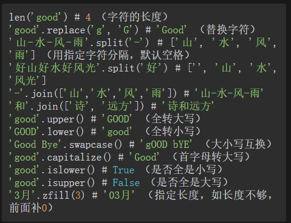
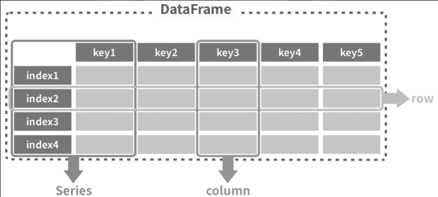

# 深入浅出Pandas

# 第一章: pandas概述
### pip安装第三方库
```shell
# pip安装第三方库指定镜像源
pip install 库名称 -i 镜像源地址
```

### 查看pandas版本号
```python
import pandas as pd
pd.__version__
```

## 1.3 pandas的快速入门

#### 1.3.1 pandas的安装导入
```python
# 引入Pandas库并起别名为pd
import pandas as pd
```

### 1.3.3 读取数据集
```python
import pandas as pd

# 将网络上的excel数据读取到变量df中
df = pd.read_excel("文件地址")

# 将当前同一文件及中的excel数据读取到变量df中
df = pd.read_excel("文件名")

# 显示数据
df
```
注: pandas显示数据时会自动增加一列索引(从0开始), 且数据量过大时, 只显示前后五行. 


### 1.3.4 查看数据
```python
# 查看前x 条数据 (为空时默认为五条)
df.head()

# 查看尾部x条数据(为空时默认为5条)
df.tail()

# 随机查看x条数据(为空时默认为1条)
df.sample()
```

### 1.3.5 验证数据
```python
# 查看数据的行数和列数
df.shape

# 查看数据行索引、数据类型和内存信息
df.info()

# 查看数值型列的汇总统计
df.describe()

# 查看各列字段数据类型
df.dtypes

# 显示数据行和列名
df.axes

# 显示列名
df.columns
```

#### df.info()显示的内容
```python
数据类型 
索引情况
行列数
各字段数据类型
内存占用
等
```

#### df.describe()显示的内容
```python
count  字段的总数
mean   平均数
std    标准差
min    最小值
max    最大值
四分位数
```

### 1.3.6 建立索引
```python
# 建立索引将name列作为索引并生效 
df.set_index("name", inplace=True)
```
注意: 
inplace=True 参数会将指定好索引的数据再赋值给df并生效. 
本操作并不会修改原Excel, 而是操作的内存中的df变量 ( 我们在读取数据后, 所有的操作都与原数据文件无关)

### 1.3.7 数据选取 

#### 选择一列
```python
# 查看指定列: 方式一
df["列索引"]

# 查看指定列: 方式二 (需列名符合Python变量要求)
df.列名称   
```

#### 选择多列
```python
# 查看指定多列: 方式一
df[["列索引1","列索引2"]]

# 查看指定多列: 方式二
df.loc[:, ["列索引1","列索引2"]]
```

df.loc[x,y] 是一个非常强大的数据选择函数, 其中x代表行, y代表列, 行和列都支持条件表达式, 也支持类似列表那样的切片. (如果要用自然索引, 需要用df.iloc[])

#### 选择行
```python
# 使用行索引选取
df[df.index == "行索引"]

# 用自然索引选取 (类似于列表的切片)
df[0:3]        #  选取前三行
df[0:10:2]     #  在前十个中美两个抽取一个
df.iloc[:10,:]  # 选取前十个
```

#### 指定行和列
```python
# 指定行 的列区间
df.loc["行索引","列索引1":"列索引2"]  

# 指定行区间和列区间
df.loc["行索引1":"行索引2","列索引1":"列索引2"]

```

#### 条件选择 -- 单一条件 
```python
# 指定列大于x
df[df.列索引 > x]

# 指定列为指定值
df[df.列索引 == "值"]

# 指定行索引
df[df.index == "行索引"]
```

#### 条件选择--组合条件
```python
# and 关系
df[(df["列索引"] > 90) & (df["列索引"] == "值")]

# 多重筛选
df[df["列索引"] == "值"].loc[df.列索引 > 90 ] 
```

### 1.3.8 排序 
```python
# 指定列数据升序排列
df.sort_values(by="列索引")

# 指定列数据降序排列
df.sort_values(by="列索引", ascending=False)

# 列1升序排列, 列2降序排列
df.sort_values(["列索引1","列索引2"], ascending = [True, False])
```

### 1.3.9 分组聚合 ( 数据透视表功能)
```python
# 指定列按团队分组对应列相加
df.groupby("列索引").sum()

# 指定列按团队分组求平均
df.groupby("列索引").mean()

# 不同列不同的计算方法
df.groupby("列索引").agg({
					  "列索引1":sum,       # 总和
					  "列索引2":"count",   # 总数
					  "列索引3":"mean",    # 平均
					  "列索引4":max        # 最大值
})
```

### 1.3.10 数据转换
```python
# 数据按列聚合并行列互换
df.groupby("列索引").sum().T

# 未知效果(请补充)
df.groupby("列索引").sum().stack()
df.groupby("列索引").sum().unstack()
```

### 1.3.11 增加列
```python
# 增加一个固定值的列
df["新增列名称"] = 值

# 增加汇总列
df["新增列名称"] = df.列索引1 + df.列索引2 + df.列索引3 + 列索引4

# 将计算结果赋值给新的列 
df["新增列名称"] = df.loc[:,"列索引1":"列索引2"].apply(lambda x:sum(x),sxis=1)

# 将所有为数字的列相加
df["新增列名称"] = df.sum(sxis=1)

# 增加平均列
df["新增列名称"] = df.total/列数量
```

### 1.3.12 统计分析
```python
# 返回所有列的均值
df.mean()

# 返回所有行的均值
df.mean(1)

# 返回列与列之间的相关系数
df.corr()

# 返回每一列中的非空值的个数
df.count()

# 返回每一列的最大值
df.max()

# 返回每一列的最小值
df.min()

# 返回每一列的中位数
df.median()

# 返回每一列的标准差
df.std()

# 方差
df.var()

# 众数
df.mode()
```

### 1.3.13 绘图
```python
# 指定列的折线分布
df.["列名称"].plot()

# 指定行不同列的数据变化(折线图)
df.loc["行索引","列索引1":"列索引2"].plot()

# 指定行不同列数据的柱状图
df.loc["行索引","列索引1":"列索引2"].plot.bar()

# 指定行不同列数据的横向柱状图
df.loc["行索引","列索引1":"列索引2"].plot.barh()

# 指定列不同分组总和趋势
df.groupby("列索引").sum().T.plot()

# 指定列不同组数量对比(饼状图)
df.groupby("列索引").count().列索引.plot.pie()
```

### 1.3.14 导出
```python
# 导出Excel文件
df.to_excel("文件名")

# 导出csv文件
df.to_csv("文件名")
```

# 第二章 数据结构

### 2.1.2 什么是数据结构
数据结构(Data structure) 是组织数据、储存数据的方式. 

计算机中常见的数据结构: 
	1. 栈  Stack
	2. 队列  Queue
	3. 数组  Array (数据分析中最常用的结构)
	4. 链表  Linked List
	5. 树 Tree
	6. 图  Graph

数组是由相同类型元素的集合组成. 


## 2.2 Python的数据结构

不可变数据类型(只能读取不能操作):
	1. Number  数字
	2. String  字符串
	3. Tuple  元组

可变数据类型:
	1. List  列表
	2. Dictionary  字典
	3. Set 集合

使用type()函数查看数据类型: 
```python
type()
```

使用isinstance判断数据是不是指定类型
```python
isinstance(数据,数据类型)
```

### 2.2.1 数字
```python
int 整型 
float  浮点型
complex  复数
```

### 2.2.2 字符串及常用操作
```python
# 显示字符串的某个值
字符串[索引]

# 字符串的切片
字符串[索引1:索引2]

# 字符串的复制
字符串[:]

# 字符串字符反转
字符串[::-1]
```


### 2.2.3 布尔型
布尔型只包含 False 和 True, 分别代表假 和 真. 

检测变量时, 以下情况会得到假, 其他情况为真:
	1. None
	2. False
	3. 0
	4. 0.0
	5. 0j (虚数)
	6. Decimal (0)
	7. Fraction (0,1)
	8. 空字符串 ""
	9. 空元组 ()
	10. 空列表 []
	11. 空字典{}
	12. 空集合 set()
	13. 对象默认为True , 除非它有bool()方法且返回False, 或有len()方法且返回为0

常见的布尔运算
```python
False and True  = False
False or True  = True
not False = True
not True = False
```

### 2.2.4 列表 list[]
```python
a = [1, 2, 3] 
len(a) # 3（元素个数） 
max(a) # 3（最大值） 
min(a) # 1（最小值） 
sum(a) # 6（求和） 
a.index(2) # 1（指定元素位置） 
a.count(1) # 1（求元素的个数） 
for i in a: print(i) # 迭代元素 
sorted(a) # 返回一个排序的列表，但不改变原列表 
any(a) # True（是否至少有一个元素为真） 
all(a) # True（是否所有元素为真） 
a.append(4) # a: [1, 2, 3, 4]（增加一个元素） 
a.pop() # 每执行一次，删除最后一个元素 
a.extend([9,8]) # a: [1, 2, 3, 9, 8]（与其他列表合并） 
a.insert(1, 'a') # a: [1, 'a', 2, 3]（在指定索引位插入元素，索引从0开始） 
a.remove('a') # 删除第一个指定元素 
a.clear() # []（清空）
```

推导式: 用for循环结合if表达式生成一个列表
```python
# 将一个可迭代的对象展开，形成一个列表 
[i for i in range(5)] 
# [0, 1, 2, 3, 4] 

# 可以将结果进行处理 
['第'+str(i) for i in range(5)] 
# ['第0', '第1', '第2', '第3', '第4'] 

# 可以进行条件筛选，实现取偶数
[i for i in range(5) if i%2==0] 

# 拆开字符，过滤空格，全变成大写 
[i.upper() for i in 'Hello world' if i != ' '] 
# ['H', 'E', 'L', 'L', 'O', 'W', 'O', 'R', 'L', 'D']
```

### 2.2.5 元组 tuple()
元组与列表类似, 但是元组不可该表, 列表可改变. 

### 2.2.6 字典 dic{}
```python
d = {} # 定义空字典 
d = dict() # 定义空字典 
d = {'a': 1, 'b': 2, 'c': 3} 
d = {'a': 1, 'a': 1, 'a': 1} # {'a': 1} key不能重复，重复时取最后一个 
d = {'a': 1, 'b': {'x': 3}} # 嵌套字典 
d = {'a': [1,2,3], 'b': [4,5,6]} # 嵌套列表 

# 以下均可定义如下结果 
# {'name': 'Tom', 'age': 18, 'height': 180} 
d = dict(name='Tom', age=18, height=180) 
d = dict([('name', 'Tom'), ('age', 18), ('height', 180)]) 
d = dict(zip(['name', 'age', 'height'], ['Tom', 18, 180]))
```

字典的访问
```python
d['name'] # 'Tom'（获取键的值） 
d['age'] = 20 # 将age的值更新为20 
d['Female'] = 'man' # 增加属性 
d.get('height', 180) # 180 

# 嵌套取值 
d = {'a': {'name': 'Tom', 'age':18}, 'b': [4,5,6]} 
d['b'][1] # 5 
d['a']['age'] # 18
```

字典的常用操作方法
```python
d.pop('name') # 'Tom'（删除指定key） 
d.popitem() # 随机删除某一项 
del d['name'] # 删除键值对 
d.clear() # 清空字典 

# 按类型访问，可迭代 
d.keys() # 列出所有键 
d.values() # 列出所有值 
d.items() # 列出所有键值对元组（k, v） 

# 操作 
d.setdefault('a', 3) # 插入一个键并给定默认值3，如不指定，则为None 
d1.update(dict2) # 将字典dict2的键值对添加到字典dict 
# 如果键存在，则返回其对应值；如果键不在字典中，则返回默认值 
d.get('math', 100) # 100 
d2 = d.copy() # 深拷贝，d变化不影响d2 

d = {'a': 1, 'b': 2, 'c': 3} 
max(d) # 'c'（最大的键） 
min(d) # 'a'（最小的键） 
len(d) # 3（字典的长度） 
str(d) # "{'a': 1, 'b': 2, 'c': 3}"（字符串形式） 
any(d) # True（只要一个键为True） 
all(d) # True（所有键都为True） 
sorted(d) # ['a', 'b', 'c']（所有键的列表排序）
```

### 2.2.7 集合 set{}
集合(set) 是存放无顺序、无索引内容的容器. 
```python
s = {} # 空集合 
s = {'5元', '10元', '20元'} # 定义集合 
s = set() # 空集合 
s = set([1,2,3,4,5]) # {1, 2, 3, 4, 5}（使用列表定义） 
s = {1, True, 'a'} 
s = {1, 1, 1} # {1}（去重） 
type(s) # set（类型检测）
```

集合没有顺序, 没有索引所以无法指定位置去访问, 但是可以用for遍历的方式去读取. 
```python
s = {'a', 'b', 'c'} 

# 判断是否有某个元素 
'a' in s # True 

# 添加元素 s.add(2) # {2, 'a', 'b', 'c'} 
s.update([1,3,4]) # {1, 2, 3, 4, 'a', 'b', 'c'} 

# 删除和清空元素 
s.remove('a') # {'b', 'c'}（删除不存在的会报错） 
s.discard('3') # 删除一个元素，无则忽略，不报错 
s.clear() # set()（清空）
```

集合的数学运算
```python
s1 = {1,2,3} 
s2 = {2,3,4} 

s1 & s2 # {2, 3}（交集） 
s1.intersection(s2) # {2, 3}（交集） 
s1.intersection_update(s2) # {2, 3}（交集，会覆盖s1） 

s1 | s2 # {1, 2, 3, 4}（并集） 
s1.union(s2) # {1, 2, 3, 4}（并集） 

s1.difference(s2) # {1}（差集） 
s1.difference_update(s2) # {1}（差集，会覆盖s1） 

s1.symmetric_difference(s2) # {1, 4}（交集之外） 

s1.isdisjoint(s2) # False（是否没有交集） 
s1.issubset(s2) # False （s1是否是s2的子集） 
s1.issuperset(s2) # False（s1是否是s2的超集，即s1是否包含s2中的所有元素）
```

## 2.3 NumPy

## 2.4 Pandas的数据结构

Pandas提供Series和DataFrame作为数组数据的储存框架.

### 2.4.1 Series  
Series等同于Excel表格中的数据列, 是Pandas最基础的数据结构

### 2.4.2 DataFrame
DateFrame等同于excel表格中的工作表. 


### 2.4.3 索引
索引 : index  指的是行和列上的标签, 标识二维数据坐标的行索引和列索引, 默认情况下, 指的是行索引. 

## 2.5 Pandas生成数据

### 2.5.2 创建数据 ----键值为列索引
```python
# df = pd.DataFrame({列索引1:列表1,})

df = pd.DataFrame({
				   '国家': ['中国', '美国', '日本'],
				   '地区': ['亚洲', '北美', '亚洲'],
				   '人口': [13.97, 3.28, 1.26], 
				   'GDP': [14.34, 21.43, 5.08], 
				   })
```

单独创建一个Series
```python
df = pd.Series([列表], name = "列索引")
```

查看数据类型
```python
type()
```

### 2.5.3 生成 Series  ----Pandas最基础的数据结构
```python
s = pd.Series(data, index = index)
```

列表和元组可以直接放入pd.Series()
```python
pd.Series(['a', 'b', 'c', 'd', 'e']) 
pd.Series(('a', 'b', 'c', 'd', 'e'))
```

### 2.5.4 生成DataFrame

```python
# DataFrame 最基本的定义格式
df = pd.DataFrame(data=None, index=None, columns=None)

	1. data : 具体数据
	2. index: 行索引
	3. columns: 列索引
```

#### 1. 字典
字典中的键为列名, 值一般为一个列表或者元组. 
```python
df = pd.DataFrame({key1:value1,})

# 生成时指定行索引
df = pd.DataFrame({key1:value1,}, index = ["行索引1","行索引2"])
```

#### 2. Series组成的字典
字典里的一个键值对为一列数据, 键为列名, 值是一个Series
```python
d = {'x': pd.Series([1., 2., 3.],index=['a', 'b', 'c']), 
	 'y': pd.Series([1., 2., 3., 4.], 
	 index=['a', 'b', 'c', 'd'])
	 } 

df = pd.DataFrame(d) 
```

#### 3. 字典组成的列表
由字典组成一个列表, 每个字典是一行数据, 指定索引后会使用指定索引
```python
# 定义一个字典列表 
data = [{'x': 1, 'y': 2}, {'x': 3, 'y': 4, 'z': 5}] 

# 生成DataFrame对象 
pd.DataFrame(data) 

# 指定索引 
pd.DataFrame(data, index=['a', 'b']) 
```

#### 4. Series生成
一个Series会生成只有一列的DataFrame
```python
s = pd.Series(['a', 'b', 'c', 'd', 'e']) 
pd.DataFrame(s)
```

#### 5. 其他方法
```python
# 从字典里生成 
pd.DataFrame.from_dict({'国家': ['中国', '美国', '日本'],'人口': [13.97, 3.28, 1.26]}) 

# 从列表、元组、ndarray中生成 
pd.DataFrame.from_records([('中国', '美国', '日本'), (13.97, 3.28, 1.26)]) 

# 列内容为一个字典 
pd.json_normalize(df.col) 
df.col.apply(pd.Series)
```

## 2.6 Pandas的数据类型

### 2.6.1 数据类型查看
```python
# 查看各字段的数据类型
df.dtypes

# 查看指定列的数据类型
df.列索引.dtype
```

### 2.6.2 Pandas常见数据类型 

	1. 默认数据类型: int64 和 float64
	2. 默认文字数据类型: object
	3. float
	4. int
	5. bool
	6. datetime64[ns]
	7. datetime64[ns,tz]
	8. timedelta64[ns]
	9. timedelta[ns]
	10. category
	11. object
	12. string

### 2.6.3 数据类型检测
可以使用类型判断方法检测数据的类型是否与该方法中指定的类型一致, 如果一致, 则返回True, 注意传入的是一个 Series
```python
pd.api.types.is_bool_dtype(s) 
pd.api.types.is_categorical_dtype(s) 
pd.api.types.is_datetime64_any_dtype(s) 
pd.api.types.is_datetime64_ns_dtype(s) 
pd.api.types.is_datetime64_dtype(s) 
pd.api.types.is_float_dtype(s) 
pd.api.types.is_int64_dtype(s) 
pd.api.types.is_numeric_dtype(s) 
pd.api.types.is_object_dtype(s) 
pd.api.types.is_string_dtype(s) 
pd.api.types.is_timedelta64_dtype(s)
```

# 第三章 Pandas数据读取与输出

## 3.1 数据读取

| **格式** | **文件格式** |       **读取函数**       | **写入(输出)函数** |
| :----: | :------: | :------------------: | :----------: |
| binary |  Excel   |      read_excel      |   to_excel   |
|  text  |   CSV    | read_csv, read_table |    to_csv    |
|  text  |   JSON   |      read_json       |   to_json    |
|  text  | 网页HTML表格 |      read_html       |   to_html    |
|  text  |  本地剪贴板   |    read_clipboard    | to_clipboard |
|  SQL   | SQL查询数据库 |       read_sql       |    to_sql    |
|  text  | Markdown |                      | to_markdown  |
### 3.1.1 CSV文件
```python
# 文件目录 
# 如果文件与代码文件在同一目录下 
df = pd.read_csv('data.csv') 

 # 指定目录 
df = pd.read_csv('data/my/data.csv')

# CSV文件的扩展名不一定是.csv
df = pd.read_csv('data/my/my.data') 

# 使用URL 
pd.read_csv('https://www.gairuo.com/file/data/dataset/GDP-China.csv')
```

### 3.1.2 Excel
```python
# 返回DataFrame 

# 默认读取第一个标签页Sheet 
pd.read_excel('team.xlsx') 

# 指定Sheet 
pd.read_excel('path_to_file.xlsx', sheet_name='Sheet1') 

# 从URL读取 
pd.read_excel('https://www.gairuo.com/file/data/dataset/team.xlsx')
```

### 3.1.3 JSON
```python
# data.json为同目录下的一个文件 
pd.read_json('data.json')
```

### 3.1.4 HTML
```python
dfs = pd.read_html('https://www.gairuo.com/p/pandas-io')
dfs[0] # 查看第一个df 

# 读取网页文件，第一行为表头 
dfs = pd.read_html('data.html', header=0) 

# 第一列为索引 
dfs = pd.read_html(url, index_col=0)
```

网页中有多个表格, 通过指定元素获取
```python
# id='table'的表格，注意这里仍然可能返回多个 
dfs1 = pd.read_html(url, attrs={'id': 'table'}) 
# dfs1[0] 
# class='sortable' 
dfs2 = pd.read_html(url, attrs={'class': 'sortable'})
```

### 3.1.5 剪贴板
```python
cdf = pd.read_clipboard()
```

### 3.1.6 SQL
```python
# 需要安装SQLAlchemy库 
from sqlalchemy import create_engine 
# 创建数据库对象，SQLite内存模式 
engine = create_engine('sqlite:///:memory:') 
# 取出表名为data的表数据 
with engine.connect() as conn, conn.begin(): 
	data = pd.read_sql_table('data', conn) 
	

# data 
# 将数据写入 
data.to_sql('data', engine) 
# 大量写入 
data.to_sql('data_chunked', engine, chunksize=1000) 
# 使用SQL查询 
pd.read_sql_query('SELECT * FROM data', engine)
```

## 3.2 读取CSV